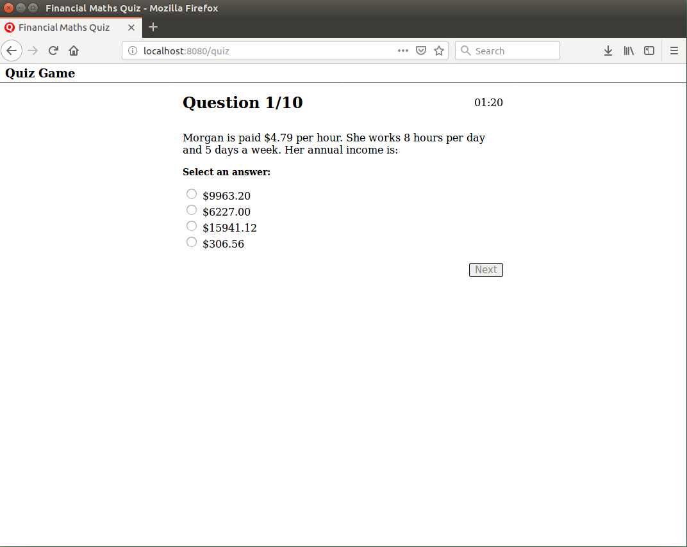

# Personal Finance Quiz
A web app for a personal finance quiz based on the New South Wales HSC General Maths 2 syllabus. The quiz includes 80 original multiple choice questions.

I created this app to learn angular.

## Getting Started

### Prequisites
1. Install nodejs and npm
2. Install MongoDB
3. Install Git

### Install and start the application
1. Clone the git repo into the directory you would to install the application into. You can do this by opening a terminal or command prompt, navigating to the desired directory and running

    $ git clone \<git repo url\>
2. Install the app's node package dependencies by running

    $ npm install
3. Ensure that a local mongodb server is running and listening on localhost:27017.
4. Import questions into the quiz_game database in the mongo server by running

    $ mongoimport -d quiz_game -c questions --jsonArray --file data/test-questions.json
5. Build and start the application's web server by running
    
    $ npm start
6. The application can now be accessed by opening your web browser at http://localhost:8080

This is an example of the quiz questions

